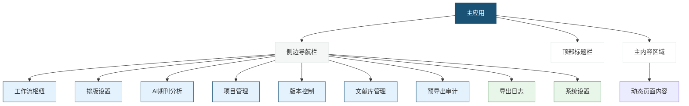
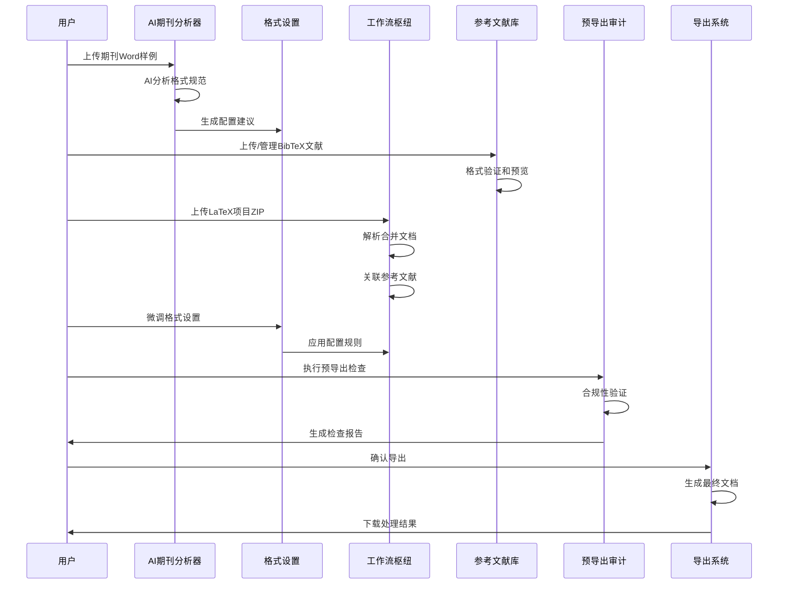

学术精度系统是一个基于Web的专业化学术文档处理平台，专为研究人员和学术工作者设计，用于自动化处理复杂的文档格式转换、参考文献管理和期刊模板适配任务。

## 系统定位与核心价值

本系统解决学术研究者在投稿过程中面临的三大核心痛点：
- **格式复杂性**：不同期刊的排版要求差异巨大，手动调整耗时且易出错
- **文献管理**：BibTeX数据的手动整理和格式统一困难
- **效率瓶颈**：重复性的文档处理工作占用大量研究时间

通过AI驱动的智能分析和自动化流水线，系统能够在数分钟内完成传统需要数小时的手动文档处理工作。

## 技术架构概览

### 前端技术栈
系统采用现代化的Web技术构建，确保高性能和良好的用户体验：

| 技术组件 | 版本 | 用途 |
|---------|------|------|
| React | 19.0.1 | 用户界面框架 |
| TypeScript | 5.8.2 | 类型安全的代码开发 |
| Vite | 6.2.3 | 构建工具和开发服务器 |
| Tailwind CSS | 4.1.14 | 原子化CSS样式系统 |
| React Router DOM | 7.14.2 | 页面路由管理 |

### 核心功能库
| 库名称 | 用途 |
|--------|------|
| @google/genai | AI模型集成，用于智能格式分析 |
| docx.js | Word文档生成和处理 |
| JSZip | ZIP文件解析（LaTeX项目处理） |
| file-saver | 文件下载功能 |

## 系统功能模块

### 1. 工作流枢纽 (Workflow Hub)
**核心文档处理引擎**，支持：
- LaTeX项目的ZIP文件上传和解析
- 多文件合并（自动识别主文件和`\input`/`\include`指令）
- 参考文献文件（.bib）的自动关联
- 实时处理日志和进度监控
- Pandoc集成检查

### 2. AI期刊分析器
**智能化配置生成器**，功能包括：
- 上传Word样例文档进行AI分析
- 自动提取排版规范（字体、字号、标题层级）
- 智能识别中西文字体映射机制
- 生成结构化的JSON配置规则
- 支持LongCat等AI模型

### 3. 参考文献库管理
**可视化BibTeX管理系统**：
- 文献条目的CRUD操作
- 实时预览多种引用格式（GB/T 7714、APA、IEEE）
- 搜索和过滤功能
- 格式验证和对齐

### 4. 格式设置系统
**精细化排版控制**：
- 字体设置（中西文字体独立配置）
- 标题层级样式（最多4级）
- 页面设置（页边距、分栏）
- 段落格式（行距、缩进）
- 图表标题样式
- 公式和参考文献格式

### 5. 项目管理与版本控制
- 项目创建和管理
- 文档版本追踪
- 配置版本管理

### 6. 预导出审计
- 导出前的完整性检查
- 格式合规性验证
- 问题报告和修复建议

## 系统界面结构



## 典型工作流程



## 文件结构组织

```
src/
├── App.tsx                 # 主应用组件，路由控制
├── main.tsx               # 应用入口点
├── components/layout/     # 布局组件
│   ├── Header.tsx         # 顶部标题栏
│   └── Sidebar.tsx        # 侧边导航栏
├── pages/                 # 页面组件
│   ├── WorkflowHub.tsx    # 工作流枢纽
│   ├── FormatSettings.tsx # 格式设置
│   ├── AiAnalysis.tsx     # AI期刊分析
│   ├── ReferenceLibrary.tsx # 参考文献库
│   └── ...其他页面
└── lib/                   # 工具函数库
    ├── testBibtexGenerator.ts
    ├── testDocxGenerator.ts
    └── testLatexGenerator.ts
```

## 系统特性总结

### 智能化
- AI驱动的格式配置生成
- 自动识别文档结构和样式规则
- 智能错误检测和修复建议

### 专业化
- 符合中文学术出版标准（GB/T 7714）
- 支持多种国际引用格式（APA、IEEE）
- 专业的排版控制选项

### 高效性
- 批量文档处理能力
- 实时预览和即时反馈
- 自动化流水线减少人工操作

### 可扩展性
- 模块化的插件架构
- 支持自定义格式规则
- API接口便于集成

## 下一步指南

对于初次使用本系统的开发者，建议按照以下顺序进行学习：

1. **快速开始**：首先阅读 [快速开始：处理您的第一个学术文档](2-kuai-su-kai-shi-chu-li-nin-de-di-ge-xue-zhu-wen-dang) 来了解基本操作流程

2. **核心概念**：深入学习 [核心概念与工作流](3-he-xin-gai-nian-yu-gong-zuo-liu) 理解系统设计理念

3. **功能探索**：根据需要选择阅读特定模块的深度解析文档，如：
   - [工作流枢纽：文档转换核心](5-gong-zuo-liu-shu-niu-wen-dang-zhuan-huan-he-xin)
   - [AI期刊分析器：智能配置生成](6-aiqi-kan-fen-xi-qi-zhi-neng-pei-zhi-sheng-cheng)
   - [参考文献库管理](7-can-kao-wen-xian-ku-guan-li)