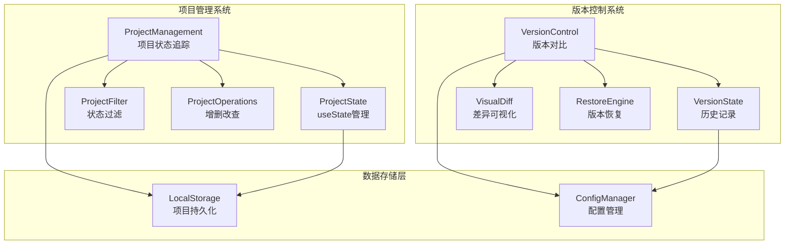
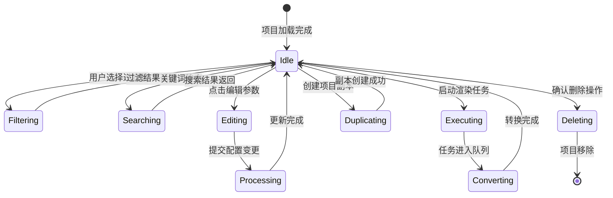
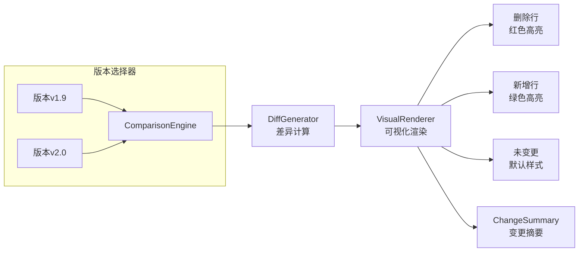
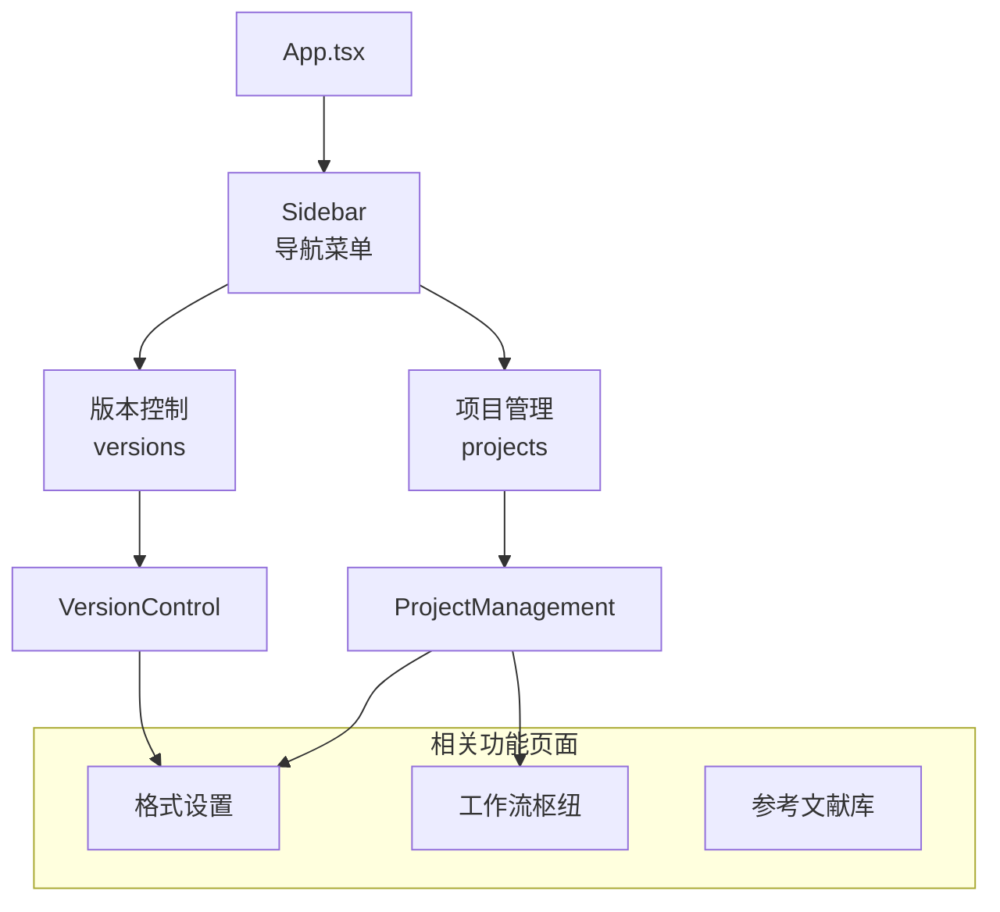

## 架构设计

学术精准系统的项目管理和版本控制模块采用前后端分离的组件化架构，通过React hooks实现状态管理，提供项目全生命周期管理和配置版本追踪功能。

### 核心组件架构



## 项目管理核心功能

### 项目状态追踪

系统采用状态机模式管理项目生命周期，支持四种核心状态：

| 状态类型 | 标识符 | 视觉特征 | 可执行操作 |
|---------|--------|----------|-----------|
| **草稿** | `draft` | 灰色圆点 | 编辑、启动、删除 |
| **排版中** | `converting` | 蓝色脉冲圆点 | 编辑、启动、删除 |
| **已完成** | `completed` | 绿色圆点 | 查看报告、删除 |
| **归档** | `archived` | 透明度80% | 恢复、删除 |

### 项目数据结构

```typescript
interface AcademicProject {
  id: number;              // 项目唯一标识
  name: string;            // 项目名称
  path: string;            // 文件路径
  config: string;          // 配置文件名
  target: string;          // 目标期刊
  status: 'draft' | 'converting' | 'completed';  // 当前状态
  statusText: string;      // 状态显示文本
  lastModified: string;    // 最后修改时间
  author: string;          // 修改者
}
```

**来源**: [ProjectManagement.tsx](src/pages/ProjectManagement.tsx#L8-L22)

### 交互操作体系

项目管理界面提供丰富的交互功能：



## 版本控制系统

### 差异可视化引擎

版本控制模块采用语法高亮的diff展示，支持JSON格式的配置对比：



**来源**: [VersionControl.tsx](src/pages/VersionControl.tsx#L55-L95)

### 版本恢复机制

系统提供一键版本恢复功能，包含以下步骤：

1. **版本选择**：从历史记录中选择目标版本
2. **差异分析**：计算当前配置与目标版本的差异
3. **用户确认**：显示变更摘要并请求确认
4. **配置回滚**：将配置恢复到选定版本
5. **状态同步**：更新UI状态并通知其他组件

### 版本数据结构

```typescript
interface ConfigVersion {
  id: string;              // 版本标识 (v1.0, v2.0)
  date: string;            // 创建时间
  desc: string;            // 版本描述
  current: boolean;        // 是否为当前版本
  configSnapshot: any;     // 配置快照
}
```

**来源**: [VersionControl.tsx](src/pages/VersionControl.tsx#L8-L11)

## 集成与导航

### 系统导航结构



**来源**: [App.tsx](src/App.tsx#L1-L41)

### 状态管理架构

系统采用React useState进行组件级状态管理：

- **ProjectManagement**: 管理项目列表、过滤状态、搜索关键词
- **VersionControl**: 管理版本历史、选中版本、差异显示
- **App**: 管理当前激活的标签页，协调各模块通信

## 最佳实践建议

### 项目管理工作流程

1. **创建项目**：从工作流枢纽创建新项目，配置目标期刊模板
2. **配置格式**：在格式设置页面调整排版参数
3. **版本快照**：关键配置变更后创建版本标记
4. **监控状态**：在项目管理页面跟踪转换进度
5. **恢复版本**：如遇到问题，使用版本控制恢复到稳定状态

### 版本管理策略

- **里程碑标记**：在重要配置变更后创建版本（如`v1.0_初始配置`）
- **描述规范**：使用清晰的版本描述，便于后续识别
- **定期清理**：归档已完成项目的历史版本，保持系统性能
- **差异审查**：在恢复版本前仔细审查差异报告

## 技术实现要点

### 性能优化

- **虚拟滚动**：项目列表支持大量项目的高效渲染
- **差异算法**：使用高效的diff算法计算配置变更
- **状态持久化**：项目状态自动保存到本地存储

### 用户体验

- **实时状态更新**：项目状态实时显示，无需手动刷新
- **操作反馈**：所有用户操作提供即时反馈
- **视觉层次**：通过颜色、图标和动画创建清晰的视觉层次

---

**下一步学习路径**: 
- 了解[工作流枢纽：文档转换核心](5-gong-zuo-liu-shu-niu-wen-dang-zhuan-huan-he-xin)以理解项目创建流程
- 探索[格式设置：精细化排版控制](8-ge-shi-she-zhi-jing-xi-hua-pai-ban-kong-zhi)以掌握配置参数
- 深入学习[参考文献库管理](7-can-kao-wen-xian-ku-guan-li)以完善项目管理