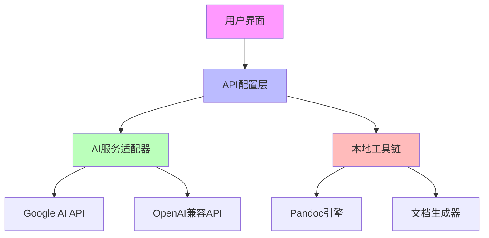

本文档详细阐述学术精度系统的外部集成架构和API配置机制，涵盖AI服务连接、本地工具链集成以及环境配置管理。

## 系统架构概览

学术精度系统采用分层架构设计，通过API层实现外部服务集成和内部工具链的统一管理。系统支持Google AI、OpenAI兼容API等多种AI服务，同时集成Pandoc文档转换引擎。



**架构组件说明：**
- **API配置层**：统一管理所有外部服务的认证和连接参数
- **AI服务适配器**：抽象不同AI提供商API差异，提供统一接口
- **本地工具链**：集成Pandoc等本地二进制工具

Sources: [package.json](package.json) [src/pages/SystemSettings.tsx](src/pages/SystemSettings.tsx)

## AI服务集成配置

### Google AI API集成

系统通过官方`@google/genai`库集成Google AI服务，支持Gemini系列模型。

**环境变量配置：**
```bash
# .env.example
GEMINI_API_KEY="MY_GEMINI_API_KEY"
APP_URL="MY_APP_URL"
```

**Vite构建配置：**
```typescript
// vite.config.ts
define: {
  'process.env.GEMINI_API_KEY': JSON.stringify(env.GEMINI_API_KEY),
}
```

**关键特性：**
- 运行时从用户密钥自动注入API密钥
- 支持自引用链接和OAuth回调
- 云环境自动配置Cloud Run服务URL

Sources: [package.json](package.json) [vite.config.ts](vite.config.ts) [.env.example](.env.example)

### OpenAI兼容API支持

系统支持与OpenAI API兼容的第三方服务，提供灵活的AI服务切换能力。

**配置参数：**

| 参数 | 描述 | 示例值 |
|------|------|--------|
| API密钥 | OpenAI兼容API认证密钥 | `ak_27v99L6QN8Ti7wD9r460c8Be1Dn74` |
| Base URL | API服务器地址 | `https://api.longcat.chat/openai` |
| 模型 | 对话模型选择 | `longcat-flash-chat` |

**支持模型：**
- **LongCat-Flash-Chat**：推荐，快速精准
- **GPT-4 学术专业版**：深度学术分析
- **Claude 3 Opus**：复杂内容解析

Sources: [src/pages/SystemSettings.tsx](src/pages/SystemSettings.tsx) [src/pages/AiAnalysis.tsx](src/pages/AiAnalysis.tsx)

## 本地工具链集成

### Pandoc文档转换引擎

系统深度集成Pandoc作为核心文档转换引擎，支持多种格式互转。

**配置选项：**
- **二进制路径**：自定义Pandoc可执行文件位置
- **环境变量回退**：自动从系统PATH推断路径
- **默认路径**：`/usr/local/bin/pandoc`

**集成模式：**
- 直接调用本地二进制文件
- 支持自定义转换参数
- 错误处理和路径验证

### 文档生成器组件

系统内置多种文档格式生成器，支持学术文档的全流程处理。

**生成器组件：**
- **DOCX生成器**：Word文档处理
- **LaTeX生成器**：学术排版系统
- **BibTeX生成器**：参考文献管理

Sources: [src/lib/testDocxGenerator.ts](src/lib/testDocxGenerator.ts) [src/lib/testLatexGenerator.ts](src/lib/testLatexGenerator.ts) [src/lib/testBibtexGenerator.ts](src/lib/testBibtexGenerator.ts)

## 配置管理最佳实践

### 安全配置

1. **API密钥管理**
   - 优先使用环境变量注入
   - 前端设置页面提供密码输入框
   - 敏感信息不硬编码在代码中

2. **连接测试机制**
   - 实时验证API连通性
   - 延迟测试和错误反馈
   - 自动重试和超时处理

### 性能优化

1. **HMR配置**
   - 开发环境热模块替换控制
   - 文件 watching 优化
   - 防止AI Studio编辑时闪烁

2. **构建优化**
   - TypeScript严格模式
   - Tailwind CSS优化
   - 依赖预构建

## 故障排除

### 常见连接问题

| 问题现象 | 可能原因 | 解决方案 |
|----------|----------|----------|
| API连接失败 | 密钥无效或过期 | 检查环境变量配置 |
| 模型无响应 | Base URL格式错误 | 验证URL包含协议头 |
| 延迟过高 | 网络或服务器问题 | 测试连通性并切换服务 |

### 调试工具

- **连接测试**：系统设置页面提供连通性测试按钮
- **日志查看**：导出日志页面显示详细API调用记录
- **配置验证**：实时验证配置格式和完整性

## 下一步

了解系统集成与API配置后，建议继续探索以下主题：

- [预导出审计系统](9-yu-dao-chu-shen-ji-xi-tong)：验证配置正确性
- [AI期刊分析器](6-aiqi-kan-fen-xi-qi-zhi-neng-pei-zhi-sheng-cheng)：智能配置生成
- [参考文献库管理](7-can-kao-wen-xian-ku-guan-li)：BibTeX集成