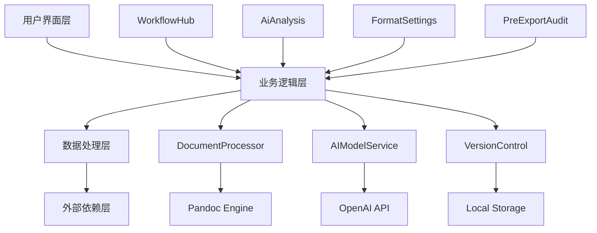
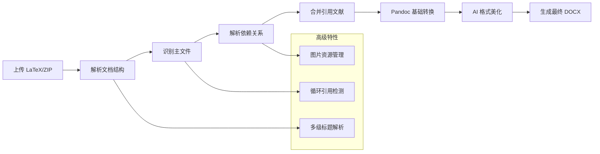

## 系统架构与核心模式

Academic Precision System 采用**模块化微前端架构**，将复杂的学术文档处理流程解耦为独立的功能模块。系统基于 React 18 + TypeScript 构建，使用 Vite 作为构建工具，实现了高性能的组件级热更新和按需加载。

### 架构分层模式


**核心架构优势**：
- **关注点分离**：每个页面模块专注于单一业务领域，降低认知负荷
- **响应式状态管理**：使用 React hooks 实现细粒度的状态控制
- **异步操作队列**：通过 `timeoutsRef` 模式管理并发异步操作，避免内存泄漏 [App.tsx]

## AI 驱动的智能配置系统

### 1. 智能文档分析引擎
`AiAnalysis.tsx` 实现了基于 LLM 的文档结构解析功能，能够自动提取 Word 文档的排版规范并生成 JSON 配置。

**高级特性**：
- **多阶段分析流水线**：文档结构解析 → 标题层级识别 → 字体映射分析 → JSON 规则生成
- **实时进度反馈**：通过 `setProgress` 和 `progressText` 提供可视化进度指示
- **配置版本管理**：支持将 AI 生成的配置与历史版本进行对比和回滚

**最佳实践**：
```typescript
// 模拟分析流程的代码结构
const simulateAnalysis = () => {
  setIsAnalyzing(true);
  setProgress(0);
  
  // 分阶段执行，每个阶段有明确的进度和状态更新
  timeoutsRef.current.push(setTimeout(() => { 
    setProgress(25); 
    setProgressText('正在解析 Word 文档结构...'); 
  }, 1000));
  
  // ... 后续阶段
};
```

### 2. 智能修复与优化
`PreExportAudit.tsx` 提供 AI 辅助的问题诊断和自动修复功能：

- **引用完整性检查**：自动检测缺失的 BibTeX 引用键
- **格式规范验证**：对比文档实际格式与目标期刊要求
- **一键修复**：通过 AI 智能算法自动修正格式冲突

## 高级文档处理工作流

### 1. 多格式文档处理管道
`WorkflowHub.tsx` 实现了复杂的文档转换流程：



### 2. LaTeX 文档智能解析
- **ZIP 包深度解析**：使用 JSZip 库处理压缩包内的嵌套文件结构
- **依赖关系解析**：自动识别 `\input` 和 `\include` 指令，构建文档依赖图
- **图片资源管理**：自动提取和映射 PNG、JPG、EPS、PDF 等格式的图像文件
- **循环引用检测**：通过 `visited` Set 防止无限递归解析

**代码示例**：
```typescript
const resolveIncludes = (content: string, currentPath: string, visited: Set<string>): string => {
  const regex = /\\(?:input|include)\{([^}]+)\}/g;
  return content.replace(regex, (match, rawIncludePath) => {
    // 规范化路径并检查循环引用
    if (visited.has(targetPath)) {
      setLogs(prev => [...prev, `[WARN] Circular inclusion detected: ${targetPath}`]);
      return match;
    }
    // ... 解析逻辑
  });
};
```

## 参考文献管理高级功能

### 1. 多标准引用格式支持
`ReferenceLibrary.tsx` 实现了参考文献的动态格式转换：

| 格式标准 | 适用场景 | 特性支持 |
|---------|---------|---------|
| GB/T 7714 | 中文学术期刊 | 国标格式，中文文献优化 |
| APA 7th | 社会科学领域 | 作者-年份格式 |
| IEEE | 工程技术领域 | 数字编号格式 |

### 2. 实时预览与验证
- **动态格式渲染**：根据选择的引用标准实时生成预览
- **智能搜索过滤**：支持按标题、作者、键值多维度搜索
- **格式验证对齐**：一键验证文献格式是否符合选定标准

## 版本控制与协作

### 1. 排版版本对比系统
`VersionControl.tsx` 提供可视化的版本差异分析：

**核心功能**：
- **JSON Diff 可视化**：高亮显示排版参数的变化
- **版本回滚**：一键恢复到历史稳定版本
- **差异报告导出**：生成版本对比的详细报告

**技术实现**：
```typescript
// 版本差异可视化
<div className="bg-[#1E1E1E] rounded-md font-code-sm">
  <pre>
    <span className="bg-[#F44747]/20 text-[#F44747]">- "font_family_cn": "宋体",</span>
    <span className="bg-[#27C93F]/20 text-[#4EC9B0]">+ "font_family_cn": "黑体",</span>
  </pre>
</div>
```

### 2. 项目状态追踪
`ProjectManagement.tsx` 实现项目生命周期的完整管理：

- **多项目并行**：支持同时管理多个学术项目
- **状态机管理**：草稿 → 排版中 → 已完成
- **自动保存机制**：系统自动保存项目状态和修改记录

## 系统配置与集成

### 1. AI 引擎高级配置
`SystemSettings.tsx` 提供深度定制能力：

**配置维度**：
- **API 密钥管理**：支持多模型 API 密钥配置
- **代理服务器设置**：可配置的 Base URL
- **模型选择**：LongCat-Flash-Chat / GPT-4 / Claude 3
- **连接测试**：一键验证 API 连通性和延迟

### 2. 核心依赖管理
- **Pandoc 路径配置**：自定义 Pandoc 二进制路径
- **导出目录设置**：指定编排产物的归档位置
- **语言环境**：支持中英文界面切换

## 最佳实践指南

### 1. 性能优化策略

**异步操作管理**：
```typescript
// 使用 timeoutsRef 统一管理定时器
const timeoutsRef = useRef<NodeJS.Timeout[]>([]);

useEffect(() => {
  return () => {
    timeoutsRef.current.forEach(clearTimeout);
  };
}, []);

// 添加新的定时器
timeoutsRef.current.push(setTimeout(() => { ... }, delay));
```

**日志自动滚动**：
```typescript
// 智能日志滚动控制
const [autoScroll, setAutoScroll] = useState(true);

useEffect(() => {
  if (autoScroll && logsContainerRef.current) {
    logsContainerRef.current.scrollTop = logsContainerRef.current.scrollHeight;
  }
}, [logs, autoScroll]);

const handleScroll = () => {
  const isAtBottom = scrollHeight - scrollTop - clientHeight < 10;
  setAutoScroll(isAtBottom);
};
```

### 2. 错误处理模式

**分级错误处理**：
- **INFO**：常规信息，不影响流程
- **WARNING**：警告信息，可继续处理
- **ERROR**：错误信息，需要人工干预

**错误恢复机制**：
- 自动回退到默认配置
- 提供详细的错误上下文信息
- 支持一键重试机制

### 3. 用户体验优化

**操作反馈设计**：
- **即时反馈**：按钮点击后立即显示加载状态
- **进度指示**：长时间操作显示进度条
- **结果通知**：操作成功/失败通过视觉和文本反馈

**无障碍设计**：
- 键盘导航支持
- 屏幕阅读器兼容
- 高对比度主题支持

## 高级使用技巧

### 1. 批量文档处理
- 使用 ZIP 包上传多个 LaTeX 文件
- 自动识别主文档和依赖关系
- 批量处理图片和引用资源

### 2. 配置模板复用
- 导出专业排版配置为 JSON
- 在不同项目间复用配置
- 基于模板快速创建新项目

### 3. AI 辅助优化
- 上传样例文档自动生成配置
- 使用 AI 智能修复格式问题
- 基于历史数据优化处理参数

## 故障排除

### 常见问题处理

| 问题现象 | 可能原因 | 解决方案 |
|---------|---------|---------|
| Pandoc 路径错误 | Pandoc 未正确安装 | 检查系统 PATH 或使用自定义路径 |
| AI 分析失败 | API 密钥无效 | 验证 API 密钥和 Base URL |
| 引用丢失 | BibTeX 键不匹配 | 检查 .bib 文件中的引用条目 |
| 格式冲突 | 页面设置不匹配 | 使用预导出审计工具修复 |

### 日志分析技巧
`ExportLogs.tsx` 提供详细的转换日志：
- 使用关键词过滤快速定位问题
- 导出完整日志用于离线分析
- 关注 ERROR 和 WARNING 级别信息

## 系统集成建议

### 1. CI/CD 集成
- 将系统配置保存为项目文件
- 在持续集成流程中复用配置
- 自动化测试文档转换流程

### 2. 团队协作
- 共享排版配置 JSON 文件
- 统一团队成员的 AI 参数设置
- 建立项目模板库

---

**推荐学习路径**：
1. 从 [系统概述](1-xi-tong-gai-shu) 开始了解整体架构
2. 通过 [快速开始](2-kuai-su-kai-shi-chu-li-nin-de-di-ge-xue-zhu-wen-dang) 实践第一个文档处理流程
3. 深入 [工作流枢纽](5-gong-zuo-liu-shu-niu-wen-dang-zhuan-huan-he-xin) 掌握核心转换机制
4. 学习 [AI期刊分析器](6-aiqi-kan-fen-xi-qi-zhi-neng-pei-zhi-sheng-cheng) 实现智能配置生成
5. 通过 [格式设置](8-ge-shi-she-zhi-jing-xi-hua-pai-ban-kong-zhi) 掌握精细化排版控制

**进阶探索**：
- [项目管理和版本控制](10-xiang-mu-guan-li-he-ban-ben-kong-zhi) 实现团队协作
- [系统集成与API配置](11-xi-tong-ji-cheng-yu-apipei-zhi) 定制个性化工作流
- 本页面详细讲解的高级功能与最佳实践