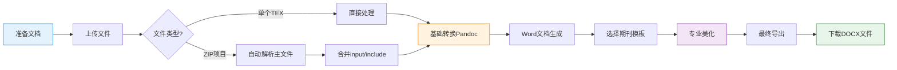

欢迎来到学术精度系统！本指南将带领您完成第一个学术文档的处理流程，从上传LaTeX源文件到生成专业排版的Word文档，全程只需几分钟时间。

## 系统启动与环境准备

### 1. 启动开发服务器
在项目根目录下执行以下命令启动开发环境：

```bash
npm run dev
```

系统将在 http://localhost:3000 启动，自动打开浏览器后即可开始使用。

### 2. 环境自动检测
系统启动后会自动检测Pandoc转换引擎的状态：

- **检测通过**：显示"Pandoc 核心引擎已就绪"，所有功能可用
- **需要安装**：显示"未检测到Pandoc环境"，点击"一键安装Pandoc"按钮自动安装

环境检测逻辑位于`src/pages/WorkflowHub.tsx`第29-78行，使用localStorage缓存安装状态。

## 第一个文档处理流程

### 步骤1：准备测试文件
系统提供两种快速开始方式：

**方式A：下载测试样本**（推荐新手）
- 点击"下载LaTeX测试样本"按钮
- 自动下载包含完整LaTeX项目结构的ZIP文件
- 包含主文件、参考文献和图片资源

**方式B：上传自己的文件**
- 支持单个`.tex`文件上传
- 或上传包含完整项目的ZIP压缩包
- 支持拖拽上传操作

文件处理入口在`src/pages/WorkflowHub.tsx`第94-227行，`parseLatexZip`函数负责解析ZIP项目结构。

### 步骤2：上传文档
进入工作流枢纽页面（系统默认首页），您将看到两个上传区域：

| 上传区域 | 功能说明 | 支持格式 |
|---------|---------|---------|
| **LaTeX/ZIP项目包** | 上传主文档或完整项目 | .tex, .zip |
| **BibTeX文献库** | 上传参考文献文件（可选） | .bib |

**上传交互**：
- 点击上传区域或拖拽文件到指定区域
- 系统自动解析文件内容并显示处理日志
- 成功上传后状态图标变为绿色勾选

上传处理逻辑见`src/pages/WorkflowHub.tsx`第229-247行。

### 步骤3：基础转换（Pandoc）
点击"执行基础转换"按钮开始文档转换：

1. **转换前检查**：
   - 确认Pandoc已安装
   - 验证已上传LaTeX文件

2. **转换过程**：
   - 系统调用Pandoc引擎进行格式转换
   - 实时显示转换日志和进度
   - 生成基础的Word文档结构

3. **转换完成**：
   - 日志显示"Raw Word document generated"
   - 进入第二阶段"专业美化"

转换功能在`src/pages/WorkflowHub.tsx`第310-334行实现，使用setTimeout模拟异步转换过程。

### 步骤4：专业美化
基础转换完成后，系统启用美化功能：

**配置文件选择**：
- 从下拉菜单选择目标期刊格式
- 支持IEEE、Nature等主流期刊模板
- 可上传自定义JSON配置文件

**美化特性**：
- 中文/英文字体分离处理
- 三线表格式对齐和边界计算
- 图表标题格式统一（仿宋_GB2312，小四号）
- 多级标题编号处理（一级、二级等）

**执行美化**：
点击"一键执行专业美化"按钮，系统应用选定的格式配置，处理时间约2-3秒。

美化逻辑见`src/pages/WorkflowHub.tsx`第337-361行。

### 步骤5：预览与导出
美化完成后，右侧预览区域显示最终文档：

**下载选项**：
- 自动生成文件名（如"转换_排版后_真实最终版.docx"）
- 点击下载图标保存到本地
- 支持在Word中打开预览

下载功能在`src/pages/WorkflowHub.tsx`第364-381行实现，使用file-saver库处理文件保存。

## 完整工作流程可视化



## 文档处理核心功能解析

### 1. LaTeX项目智能解析
系统自动识别和处理复杂LaTeX项目结构：

- **主文件检测**：通过查找`\documentclass`命令识别主文件
- **文件合并**：自动解析`\input{}`和`\include{}`指令，合并多个文件
- **循环引用检测**：防止无限递归包含
- **参考文献关联**：自动匹配`.bib`文献库文件

解析算法见`src/pages/WorkflowHub.tsx`第142-177行`resolveIncludes`函数。

### 2. 实时日志系统
系统提供完整的操作反馈：

**日志级别**：
- `[SYSTEM]`：系统操作和状态变更（蓝色）
- `[INFO]`：处理进度和信息（绿色）
- `[SUCCESS]`：操作成功完成（深绿色）
- `[ERROR]`：错误信息（红色）

**功能特性**：
- 自动滚动到底部（可手动暂停）
- 不同级别颜色区分
- 实时进度指示器

日志组件在`src/pages/WorkflowHub.tsx`第547-577行实现。

### 3. 文档生成质量
使用docx.js库生成专业级Word文档：

**特性支持**：
- 标题样式（Title, Heading 1-9）
- 表格和图表环境
- 公式和引用标签
- 目录自动生成
- 参考文献格式化

**格式清理**：
- 移除LaTeX注释
- 保护转义字符
- 标准化引号
- 清理布局宏

生成逻辑见`src/lib/testDocxGenerator.ts`完整实现。

## 故障排除与最佳实践

### 常见问题

| 问题现象 | 可能原因 | 解决方案 |
|---------|---------|---------|
| Pandoc未检测到 | 未安装或路径错误 | 点击"一键安装Pandoc"按钮 |
| 主文件识别失败 | 缺少\documentclass | 确保主文件包含标准文档类声明 |
| 参考文献未关联 | .bib文件路径错误 | 上传单独的.bib文件或包含在ZIP中 |
| 图片无法显示 | 路径不匹配或格式不支持 | 确保图片在images/目录，支持png/jpg/eps/pdf |

### 最佳实践建议

1. **项目结构规范**：
   - 主文件放在项目根目录
   - 章节文件放在sections/目录
   - 图片资源放在images/目录
   - 参考文献使用references.bib命名

2. **上传前检查**：
   - 确保ZIP文件包含完整项目
   - 检查LaTeX能够正常编译
   - 验证BibTeX引用键唯一性

3. **转换优化**：
   - 大文档建议分章节处理
   - 复杂公式使用MathJax渲染
   - 表格使用tabular环境而非矩阵

## 下一步学习路径

完成第一个文档处理后，建议您继续探索：

- **[核心概念与工作流](3-he-xin-gai-nian-yu-gong-zuo-liu)**：深入理解系统工作原理
- **[格式设置：精细化排版控制](8-ge-shi-she-zhi-jing-xi-hua-pai-ban-kong-zhi)**：自定义期刊格式模板
- **[AI期刊分析器：智能配置生成](6-aiqi-kan-fen-xi-qi-zhi-neng-pei-zhi-sheng-cheng)**：使用AI自动生成格式配置
- **[参考文献库管理](7-can-kao-wen-xian-ku-guan-li)**：管理个人文献数据库

这些功能将帮助您更高效地处理学术文档，节省宝贵的研究时间。

---

**恭喜您完成第一个学术文档的处理！** 系统已经成功将您的LaTeX文档转换为专业排版的Word格式。通过本指南，您掌握了基本的文档处理流程，可以开始处理更复杂的学术文档项目了。