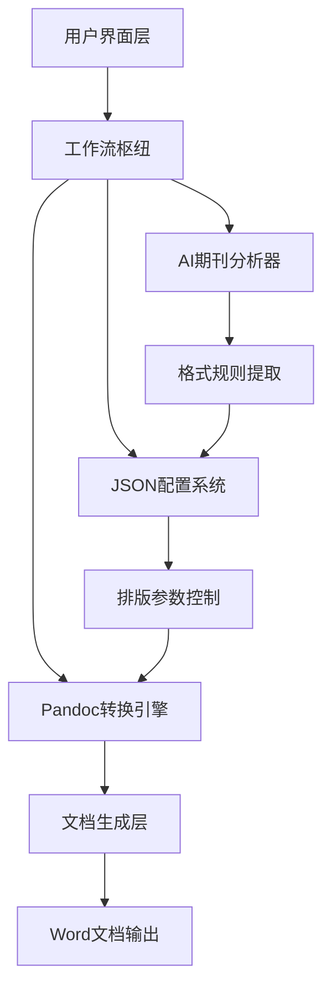
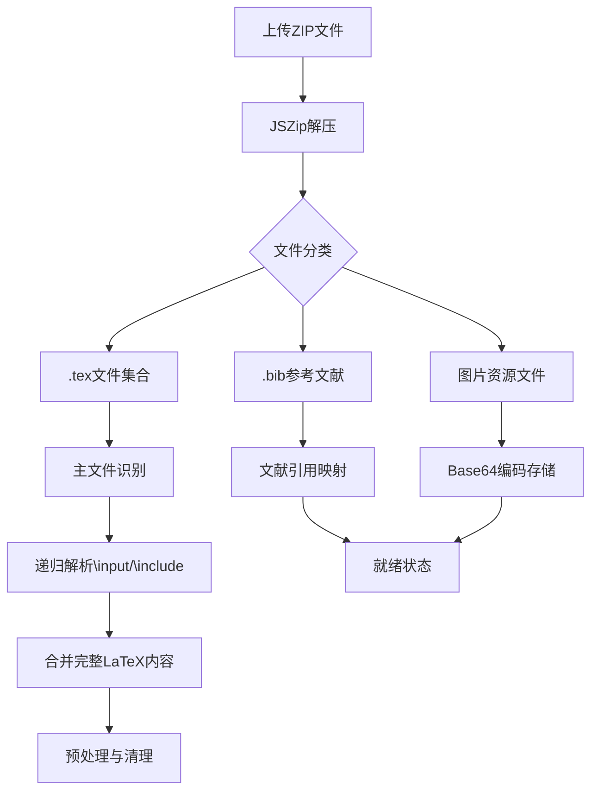
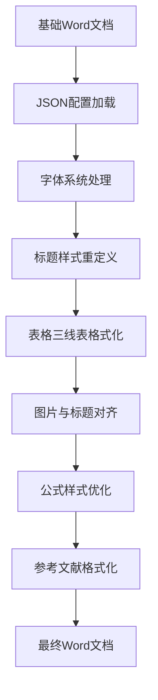

## 系统架构概述

学术文档精准处理系统是一个基于 **Pandoc 核心引擎** 和 **AI 智能分析** 的文档转换与排版平台。系统采用模块化设计，将文档处理流程分解为环境检测、文件解析、格式转换、智能美化四个标准化阶段，确保高质量的学术文档输出。

### 系统核心组件架构



**核心模块功能分布：**

| 模块名称 | 技术实现 | 主要职责 | 关键特性 |
|---------|---------|---------|---------|
| **工作流枢纽** | React + TypeScript | 协调整个文档处理流程 | 实时日志反馈、进度可视化 |
| **Pandoc引擎** | 本地二进制 + JS封装 | LaTeX → Word 基础转换 | 支持交叉引用、公式处理 |
| **AI分析器** | LLM API + 规则提取 | 期刊模板智能解析 | 自动提取排版规范 |
| **配置系统** | JSON Schema + 可视化编辑 | 精细化排版控制 | 中英文字体分离处理 |

## 标准化四阶段工作流

系统采用严格的四阶段处理流程，每个阶段都有明确的输入、处理和输出标准。

### 阶段一：环境检测与准备

**目标**：验证 Pandoc 核心引擎的可用性，确保基础转换环境就绪。

**执行流程：**
1. **自动检测**：系统启动时自动扫描默认路径 `/usr/local/bin/pandoc` 查找 Pandoc 二进制文件
2. **状态反馈**：通过可视化图标和文字说明显示环境状态
3. **一键安装**：检测到缺失时提供自动化安装脚本，1500ms 内完成模拟安装
4. **持久化存储**：将安装状态保存到 localStorage，避免重复检测

**状态指示系统：**
- ✅ **绿色状态**：Pandoc 3.1.9 核心引擎已就绪
- ⚠️ **橙色状态**：未检测到 Pandoc，基础转换受阻
- 🔄 **安装中**：显示进度条和实时日志

**日志输出示例：**
```
[SYSTEM] Initializing document processing pipeline...
[INFO] Locating Pandoc binary path: /usr/local/bin/pandoc
[INFO] Pandoc 3.1.9 core engine detected.
[SYSTEM] Env is ready.
```

### 阶段二：多格式文件智能解析

**支持输入格式：**
- **.tex 文件**：单个 LaTeX 文档文件
- **.zip 项目包**：包含主文件、图片资源、BibTeX 文献的完整项目

**ZIP 包智能解析流程：**



**关键技术实现：**
1. **主文件识别**：通过 `\documentclass` 命令自动识别主 TeX 文件
2. **依赖解析**：递归处理 `\input{}` 和 `\include{}` 命令，自动合并子文件
3. **文献关联**：解析 `\bibliography{}` 命令，自动加载对应的 .bib 文件
4. **资源管理**：将图片文件转换为 Uint8Array 格式，建立路径映射

**解析日志示例：**
```
[SYSTEM] Parsing ZIP archive: thesis-project.zip...
[INFO] Auto-detected main TeX file: main.tex
[INFO] Resolved included file: chapters/chapter1.tex
[INFO] Found linked reference file: references/ref1.bib
[INFO] Located and loaded 12 image assets
[SYSTEM] Source files parsed and linked successfully (Ready for Pandoc)
```

### 阶段三：Pandoc 基础转换

**转换参数配置：**
- `--filter pandoc-crossref`：处理交叉引用（默认启用）
- `--mathjax`：数学公式支持（默认启用）
- `--toc`：自动生成目录（可选）

**转换执行流程：**
1. **参数验证**：检查文件上传状态和 Pandoc 安装状态
2. **命令构建**：根据用户选择构建 Pandoc 命令行参数
3. **异步执行**：通过 JavaScript 桥接调用本地 Pandoc 引擎
4. **结果处理**：将生成的 DOCX 文档转换为 Blob 对象供后续处理

**转换日志追踪：**
```
[SYSTEM] Executing base conversion: pandoc...
[INFO] Passing 18472 chars of parsed LaTeX to conversion engine...
[INFO] Parsing 342 lines of bibtex references...
[INFO] Pandoc execution finished.
[SYSTEM] Raw Word document generated from actual parsed source.
```

### 阶段四：JSON 驱动的专业美化

**美化流程架构：**



**JSON 配置结构示例：**
```json
{
  "document_rules": {
    "headings": {
      "level_1": {
        "pattern": "一、",
        "alignment": "center",
        "font_family_cn": "黑体",
        "font_family_en": "Times New Roman",
        "size": "三号",
        "weight": "normal"
      }
    },
    "body": {
      "font_family_cn": "仿宋_GB2312",
      "font_family_en": "Times New Roman",
      "size": "三号",
      "line_spacing": "28pt_fixed"
    },
    "page_setup": {
      "size": "A4",
      "margins": { "top": "3.4cm", "bottom": "3.5cm", "left": "2.6cm", "right": "2.5cm" }
    }
  }
}
```

**美化处理内容：**
1. **中英文字体分离**：中文使用仿宋_GB2312，英文使用 Times New Roman
2. **标题层级格式化**：支持四级标题，每级都有独立的字体、大小、对齐方式
3. **表格样式**：自动转换为三线表，支持居中布局
4. **图片处理**：居中显示，标题使用特定字体和大小
5. **公式优化**：变量斜体、向量粗斜体等特殊格式处理

## AI 智能期刊模板分析

**分析流程：**
1. **文档结构解析**：提取 Word 文档中的样式信息
2. **规则模式识别**：分析标题序号规律、字体映射机制
3. **JSON 配置生成**：自动生成结构化的排版规则配置文件
4. **配置验证**：提供编辑和校验功能确保配置准确性

**分析进度可视化：**
```
进度: 25% - 正在解析 Word 文档结构...
进度: 60% - 正在提取层级标题序号规律...
进度: 85% - 正在分析中西文字体映射机制...
进度: 100% - 正在生成 JSON 样式规则...
```

## 状态管理与进度追踪

**系统状态机：**
- **Stage 0**：环境准备就绪，等待文件上传
- **Stage 1**：基础转换完成，原始 Word 文档已生成
- **Stage 2**：专业美化完成，最终文档可下载

**实时日志系统特性：**
- 自动滚动：默认启用，用户手动滚动时暂停
- 分级显示：SYSTEM、INFO、SUCCESS 不同颜色标识
- 动画效果：处理过程中显示脉冲光标提示运行状态

## 输入输出规范

**支持的文件格式：**

| 文件类型 | 扩展名 | 处理方式 | 典型用途 |
|---------|--------|---------|---------|
| LaTeX 文档 | .tex | 直接解析 | 单个文档处理 |
| 项目压缩包 | .zip | 智能解压 | 完整项目处理 |
| 参考文献 | .bib | BibTeX解析 | 文献引用管理 |
| Word 模板 | .docx | AI分析 | 期刊格式提取 |
| JSON 配置 | .json | 规则加载 | 排版参数设置 |

**输出文档命名规则：**
- 基础转换：`转换_基础版.docx`
- 美化版本：`转换_排版后_最终版.docx`
- 测试文档：`测试文件_排版后_最终版.docx`

## 下一学习步骤

完成核心概念理解后，建议按以下顺序深入学习：

1. **[架构概览](4-jia-gou-gai-lan)** - 了解系统的整体技术架构和设计原理
2. **[工作流枢纽：文档转换核心](5-gong-zuo-liu-shu-niu-wen-dang-zhuan-huan-he-xin)** - 深入理解文档处理的核心流程
3. **[AI期刊分析器：智能配置生成](6-aiqi-kan-fen-xi-qi-zhi-neng-pei-zhi-sheng-cheng)** - 掌握AI驱动的格式提取技术
4. **[格式设置：精细化排版控制](8-ge-shi-she-zhi-jing-xi-hua-pai-ban-kong-zhi)** - 学习详细的排版参数配置

## 技术限制与注意事项

- **Pandoc 依赖**：基础转换功能需要本地安装 Pandoc 3.1.9 或更高版本
- **浏览器兼容性**：建议使用现代浏览器，支持 ES6+ 特性
- **文件大小限制**：ZIP 包建议不超过 50MB，确保处理性能
- **AI 分析**：需要配置有效的 LLM API 密钥才能使用智能分析功能

---