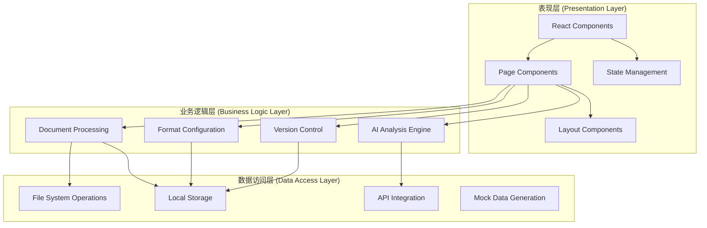
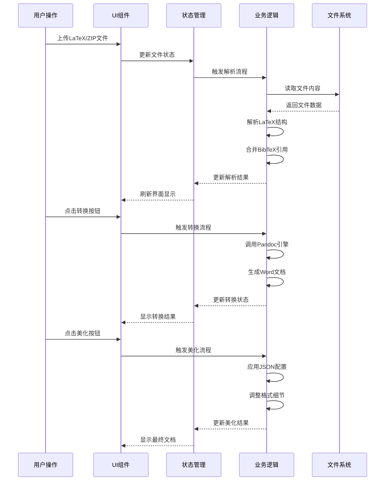

学术文档精准处理系统采用分层架构设计，结合了现代Web技术栈与学术文档处理的最佳实践。系统基于React 19构建，采用TypeScript进行类型安全开发，整体架构遵循模块化、可插拔的设计原则。

## 系统整体架构

### 技术栈构成

系统采用前后端分离的架构模式，主要技术组件如下表所示：

| 层级 | 技术组件 | 版本 | 核心功能 |
|------|----------|------|----------|
| **前端框架** | React | ^19.0.1 | 组件化UI构建 |
| **语言** | TypeScript | ~5.8.2 | 类型安全开发 |
| **构建工具** | Vite | ^6.2.3 | 快速开发与构建 |
| **UI组件** | lucide-react | ^0.546.0 | 图标系统 |
| **文档处理** | docx.js | ^9.6.1 | Word文档生成 |
| **压缩处理** | JSZip | ^3.10.1 | ZIP文件解析 |
| **样式系统** | TailwindCSS | ^4.1.14 | 原子化CSS |

### 架构分层

系统采用三层架构设计，各层职责明确，耦合度低：

**表现层**负责用户交互界面，包含9个核心页面组件和2个布局组件。采用React hooks进行状态管理，通过props进行组件间通信。

**业务逻辑层**处理核心文档转换流程，包括LaTeX解析、Pandoc集成、AI分析和格式美化等关键功能。

**数据访问层**提供文件操作、本地存储和API集成能力，支持离线模式和云端协同。

## 核心模块设计

### 1. 工作流枢纽 (WorkflowHub)

作为系统的入口点，WorkflowHub采用三阶段处理流水线设计：

- **环境检测阶段**：自动检测Pandoc安装状态，提供一键安装功能
- **基础转换阶段**：通过Pandoc引擎将LaTeX转换为Word文档
- **专业美化阶段**：基于JSON配置进行格式精调

该模块通过状态机管理处理流程，每个阶段都有明确的输入输出和错误处理机制[WorkflowHub.tsx](src/pages/WorkflowHub.tsx)。

### 2. AI期刊分析器 (AiAnalysis)

采用机器学习技术自动提取期刊排版规范：

- **文档结构解析**：识别标题层级、字体样式、页面布局
- **规则提取**：自动生成JSON格式的排版配置文件
- **配置校验**：提供可视化编辑和实时预览功能

分析器通过WebSocket与后端AI服务通信，支持多种大语言模型[AiAnalysis.tsx](src/pages/AiAnalysis.tsx)。

### 3. 格式设置系统 (FormatSettings)

提供细粒度的排版控制能力：

- **字体映射**：中西文字体分离配置
- **间距控制**：精确的段前段后、行距设置
- **样式模板**：支持IEEE、Nature等期刊模板

### 4. 参考文献库管理 (ReferenceLibrary)

基于BibTeX格式的文献管理系统：

- **文献导入**：支持ZIP包批量导入
- **引用解析**：自动识别和处理交叉引用
- **格式转换**：支持多种引用格式输出

## 数据流设计

系统采用单向数据流模式，确保数据变更的可预测性：

## 状态管理策略

系统采用React useState和useEffect hooks进行状态管理：

- **全局状态**：通过App组件的activeTab管理当前活动页面
- **页面状态**：各页面组件内部管理自己的业务状态
- **临时状态**：使用useRef管理定时器、文件引用等临时资源

状态更新遵循不可变原则，确保变更的可追踪性。

## 错误处理机制

系统采用多层错误处理策略：

1. **前端验证**：上传文件格式验证、必填字段检查
2. **业务逻辑校验**：Pandoc环境检测、文件完整性检查
3. **异常捕获**：Promise.catch处理异步错误
4. **用户反馈**：通过日志面板实时显示错误信息

所有错误都有明确的错误码和用户友好的提示信息。

## 性能优化设计

- **懒加载**：组件按需加载，减少初始包体积
- **虚拟滚动**：日志面板支持大批量数据的高效渲染
- **缓存机制**：Pandoc安装状态本地存储，避免重复检测
- **批处理**：文件上传采用批量处理模式

## 扩展性设计

系统采用插件化架构，便于功能扩展：

- **格式处理器**：可插拔的文档格式支持
- **AI模型适配器**：支持不同的大语言模型
- **导出目标**：可扩展的输出格式支持

## 安全考虑

- **文件隔离**：上传的文件在沙箱环境中处理
- **输入验证**：严格的格式检查和内容过滤
- **API密钥管理**：本地存储，不发送到第三方服务
- **错误信息脱敏**：不暴露系统内部细节

## 部署架构

系统支持多种部署模式：

- **本地开发模式**：Vite开发服务器，热重载支持
- **生产构建**：静态文件部署，支持CDN加速
- **容器化部署**：Docker容器封装，便于环境一致性

---

**下一阶段学习重点**：建议先深入了解[工作流枢纽](5-gong-zuo-liu-shu-niu-wen-dang-zhuan-huan-he-xin)的详细实现，掌握文档转换的核心流程，然后再学习[AI期刊分析器](6-aiqi-kan-fen-xi-qi-zhi-neng-pei-zhi-sheng-cheng)的智能配置生成机制。