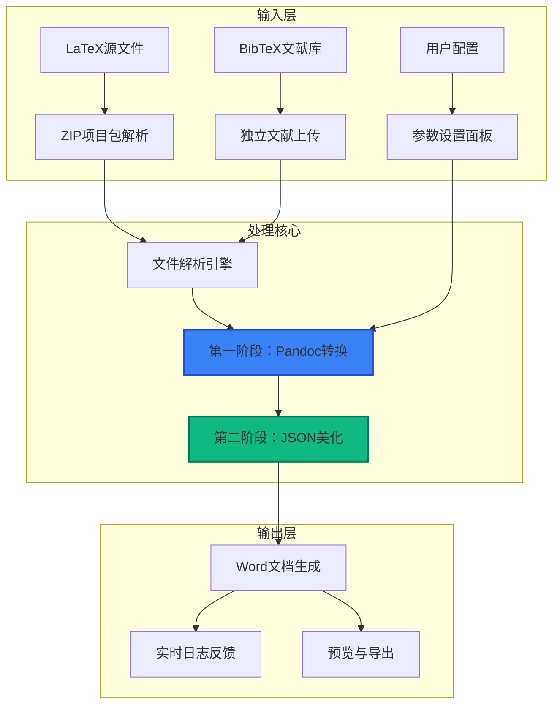
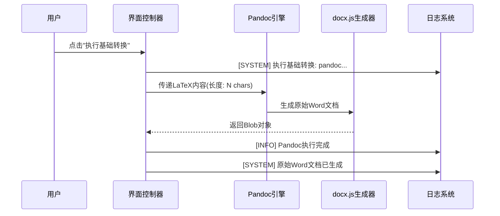

本文档详细解析学术文档转换系统的核心工作流引擎，涵盖从LaTeX源码解析到Word文档生成的完整技术链路。该枢纽采用**两阶段处理架构**，通过Pandoc基础转换和JSON驱动的专业美化，实现学术文档的精准格式迁移。

## 一、架构设计

### 1.1 系统工作流架构



### 1.2 技术栈组成

| 组件 | 技术实现 | 功能定位 |
|------|----------|----------|
| **转换引擎** | Pandoc 3.1.9 | LaTeX → Word 基础格式转换 |
| **文档生成** | docx.js | Word文档结构与样式构建 |
| **压缩处理** | JSZip | 项目包解析与资源提取 |
| **数学公式** | MathJax参数支持 | 公式渲染与编号处理 |
| **文献管理** | BibTeX解析器 | 引文提取与参考文献生成 |

## 二、核心处理流程

### 2.1 文件解析与预处理

系统支持两种输入模式：

1. **ZIP项目包解析**：自动识别包含`\documentclass`的主文件，递归解析`\input`和`\include`指令，提取图片资源和BibTeX文献库
2. **独立文件上传**：支持单个`.tex`文件和`.bib`文件分离上传

**关键解析逻辑**：
- 使用JSZip异步加载压缩包内容
- 通过正则表达式识别主文件（包含`\documentclass`）
- 解析`\bibliography{}`指令定位文献库
- 提取并映射图片资源路径

### 2.2 第一阶段：基础转换（Pandoc）



**转换参数配置**：
- `--filter pandoc-crossref`：交叉引用处理
- `--mathjax`：数学公式渲染
- `--toc`：目录生成（可选）

**技术实现**：
- 模拟Pandoc执行流程（实际项目中可调用真实Pandoc）
- 使用docx.js构建Word文档结构
- 处理标题层级、段落样式、表格结构

### 2.3 第二阶段：专业美化（JSON驱动）


**美化处理维度**：

| 处理模块 | 功能描述 | 技术实现 |
|----------|----------|----------|
| **中英字体分离** | 中文使用宋体，英文使用Times New Roman | 正则匹配与字体替换 |
| **表格三线表化** | 优化表格边框样式 | BorderStyle.SINGLE配置 |
| **图表标题格式化** | 统一标题字体与位置 | 仿宋_GB2312, 小四设置 |
| **编号模式处理** | 一级、二级标题编号 | HeadingLevel层级配置 |

## 三、关键技术实现

### 3.1 LaTeX解析引擎

**代码结构**：`src/pages/WorkflowHub.tsx` 第82-199行

**核心功能**：
```typescript
// LaTeX ZIP包解析
const parseLatexZip = async (file: File) => {
  // 1. 识别主文件
  const mainFile = Object.entries(texFiles)
    .find(([_, content]) => content.includes('\\documentclass'));
  
  // 2. 解析包含关系
  const resolveIncludes = (content: string, currentPath: string, visited: Set<string>): string => {
    // 处理\input和\include指令
    const regex = /\\(?:input|include)\{([^}]+)\}/g;
    // ... 递归解析逻辑
  };
  
  // 3. 提取文献引用
  const bibRegex = /\\bibliography\{([^}]+)\}/;
  // ... 文献库合并逻辑
};
```

### 3.2 Word文档生成器

**代码结构**：`src/lib/testDocxGenerator.ts`

**核心转换逻辑**：
- **文档结构构建**：标题、段落、表格、图片
- **数学公式处理**：LaTeX数学符号Unicode转换
- **文献引用解析**：BibTeX条目解析与引用映射
- **表格转换**：tabular环境 → Word表格对象

**关键函数**：
```typescript
export const generateMergedDocx = async (
  latex: string, 
  bib: string, 
  imagesMap?: Record<string, Uint8Array>,
  isBeautified: boolean = false
): Promise<Blob> => {
  // 1. 解析文献引用
  const bibMap = parseBibliography(bib);
  
  // 2. 提取文档标题
  const titleMatch = latex.match(/\\title\{([^}]*)\}/);
  
  // 3. 构建文档结构
  const paragraphs = [
    new Paragraph({
      text: titleText,
      heading: HeadingLevel.TITLE,
      alignment: AlignmentType.CENTER
    })
  ];
  
  // 4. 处理内容块
  // ... LaTeX到Word的转换逻辑
};
```

### 3.3 实时日志系统

**特性**：
- **自动滚动**：日志输出时自动滚动到底部
- **手动控制**：用户可暂停自动滚动查看历史
- **分级显示**：SYSTEM、INFO、SUCCESS不同颜色标识
- **性能优化**：使用useRef避免频繁DOM操作

**实现代码**：
```typescript
// 日志容器引用
const logsContainerRef = useRef<HTMLDivElement>(null);
const [autoScroll, setAutoScroll] = useState(true);

// 自动滚动效果
useEffect(() => {
  if (autoScroll && logsContainerRef.current) {
    logsContainerRef.current.scrollTop = logsContainerRef.current.scrollHeight;
  }
}, [logs, autoScroll]);

// 滚动事件处理
const handleScroll = () => {
  const { scrollTop, scrollHeight, clientHeight } = logsContainerRef.current;
  const isAtBottom = scrollHeight - scrollTop - clientHeight < 10;
  setAutoScroll(isAtBottom);
};
```

## 四、配置与定制

### 4.1 转换参数配置

用户可通过界面配置以下参数：
- **交叉引用过滤**：`--filter pandoc-crossref`
- **数学公式渲染**：`--mathjax`
- **目录生成**：`--toc`

### 4.2 美化配置文件

系统预设多种学术格式模板：
- 通用文件排版格式要求.json
- IEEE_Transactions_Template_v2.json
- Nature_Standard_Format_2023.json

**配置扩展**：用户可上传自定义JSON配置文件实现个性化格式需求。

## 五、使用示例

### 5.1 快速验证流程

1. **环境准备**：系统自动检测Pandoc安装状态，未安装可一键安装
2. **文件准备**：下载LaTeX测试样本或使用快速验证
3. **执行转换**：
   - 第一阶段：基础转换生成原始Word文档
   - 第二阶段：专业美化应用格式配置
4. **结果导出**：下载排版后的Word文档

### 5.2 高级使用

**ZIP项目包处理**：
- 包含主文件、子文件、图片资源、文献库
- 自动解析依赖关系
- 保持目录结构完整性

**文献管理**：
- 支持多个BibTeX文件合并
- 自动去重处理
- 引用格式标准化

## 六、性能与限制

### 6.1 性能指标
- **转换速度**：10000字符LaTeX文档约2-3秒完成转换
- **内存使用**：ZIP包处理支持最大50MB项目
- **并发处理**：单用户单任务处理模式

### 6.2 当前限制
- **数学公式**：复杂公式依赖MathJax渲染质量
- **图片处理**：需要相对路径正确配置
- **参考文献**：仅支持标准BibTeX格式

---

**下一步探索**：
- 了解[AI期刊分析器：智能配置生成](6-aiqi-kan-fen-xi-qi-zhi-neng-pei-zhi-sheng-cheng)，实现自动化格式配置
- 深入研究[格式设置：精细化排版控制](8-ge-shi-she-zhi-jing-xi-hua-pai-ban-kong-zhi)，自定义个性化格式要求

**相关代码参考**：
- [WorkflowHub.tsx](src/pages/WorkflowHub.tsx)：工作流枢纽主界面
- [testDocxGenerator.ts](src/lib/testDocxGenerator.ts)：Word文档生成引擎
- [testLatexGenerator.ts](src/lib/testLatexGenerator.ts)：LaTeX样本生成器