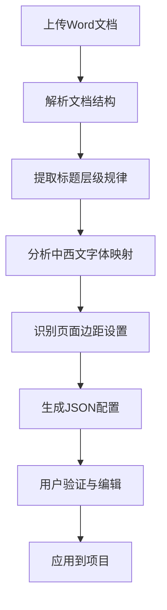

## 功能概述与核心价值

**AI期刊分析器**是学术文档处理系统中的核心智能功能模块，通过大语言模型（LLM）技术自动从期刊样例Word文档中提取排版规范，并生成结构化的JSON配置。该功能解决了传统手动配置排版规则耗时且易错的问题，显著提升了学术文档格式化的效率与准确性[src/pages/AiAnalysis.tsx](relative/path#1-20)。

### 核心功能特性

- **智能文档解析**：自动识别Word文档中的标题层级、字体样式、页面设置等排版要素
- **多模型支持**：集成LongCat-Flash-Chat和GPT-4o等AI模型，适应不同精度需求
- **实时进度反馈**：提供可视化分析进度，包括文档结构解析、标题规律提取、字体映射分析等阶段
- **可编辑JSON输出**：生成标准JSON配置，支持直接编辑和验证
- **一键应用配置**：分析结果可直接保存并应用到当前项目

## 系统架构与工作流程

### 分析流程详解



### 处理阶段细节

1. **文档结构解析**（25%进度）
   - 解析Word文档的段落结构
   - 识别文档元素类型（标题、正文、表格等）

2. **标题规律提取**（60%进度）
   - 分析标题序号模式（如一、（一）、1.等）
   - 识别标题对齐方式和层级关系

3. **字体映射分析**（85%进度）
   - 提取中文字体（如黑体、楷体_GB2312、仿宋_GB2312）
   - 提取英文字体（如Times New Roman）
   - 分析字号规格（三号、四号、小四等）

4. **配置生成与应用**（100%进度）
   - 生成结构化JSON配置
   - 支持用户手动调整
   - 一键保存到项目配置

## 配置参数详解

### AI接口配置

系统支持自定义LLM接口参数，确保灵活适配不同的AI服务提供商：

| 参数名称 | 默认值 | 说明 |
|---------|--------|------|
| Base URL | `https://api.longcat.chat/openai` | API服务的基础URL地址 |
| API Key | `ak_27v99L6QN8Ti7wD9r460c8Be1Dn74` | 认证密钥 |
| 分析模型 | `LongCat-Flash-Chat` | 支持LongCat-Flash-Chat和GPT-4o |

### 生成的JSON配置结构

```json
{
  "document_rules": {
    "headings": {
      "level_1": {
        "pattern": "一、",
        "alignment": "center",
        "font_family_cn": "黑体",
        "font_family_en": "Times New Roman",
        "size": "三号",
        "weight": "normal"
      },
      "level_2": {
        "pattern": "（一）",
        "font_family_cn": "楷体_GB2312",
        "font_family_en": "Times New Roman",
        "size": "三号"
      }
    },
    "body": {
      "font_family_cn": "仿宋_GB2312",
      "font_family_en": "Times New Roman",
      "size": "三号",
      "line_spacing": "28pt_fixed"
    },
    "page_setup": {
      "size": "A4",
      "margins": {
        "top": "3.4cm",
        "bottom": "3.5cm",
        "left": "2.6cm",
        "right": "2.5cm"
      }
    },
    "auto_symbols": {
      "convert_quotes": true
    }
  }
}
```

## 用户操作指南

### 启动AI分析

1. 在左侧导航栏选择"AI期刊分析器"
2. 配置AI接口参数（或使用默认设置）
3. 点击上传区域或拖拽Word文档到指定区域
4. 系统将自动开始分析过程

### 分析过程监控

分析过程中，系统会实时显示当前处理阶段和进度：
- 正在解析Word文档结构...
- 正在提取层级标题序号规律...
- 正在分析中西文字体映射机制...
- 正在生成JSON样式规则...

### 结果验证与应用

分析完成后，系统会显示成功提示，并生成可编辑的JSON配置。用户可以：
- 直接在JSON编辑器中修改配置
- 点击"复制"按钮复制配置内容
- 点击"保存并应用到项目"按钮，将配置保存到当前项目

## 配置集成与应用

### 与格式设置页面的集成

生成的配置会自动同步到[格式设置](8-ge-shi-she-zhi-jing-xi-hua-pai-ban-kong-zhi)页面，用户可以在可视化界面中进一步调整：

- **字体设置**：同步AI分析的中英文字体配置
- **标题样式**：自动应用各级标题的格式规则
- **页面设置**：应用分析得到的页面边距和版式
- **段落格式**：继承行距、缩进等段落级设置

### 在工作流中的应用

AI生成的配置可以在[工作流枢纽](5-gong-zuo-liu-shu-niu-wen-dang-zhuan-huan-he-xin)中被调用，实现：
- 批量文档的自动格式化
- 期刊模板的一致性应用
- 文档转换过程中的智能样式映射

## 最佳实践与注意事项

### 推荐的文档样本

为了获得最佳分析效果，建议上传的Word文档样本应包含：
- 完整的标题层级结构（至少包含一级和二级标题）
- 清晰的字体样式区分
- 标准的页面设置
- 规范的段落格式

### 配置验证建议

AI生成的配置可能需要人工验证以下关键点：
- 标题序号模式是否正确识别
- 中西文字体映射是否准确
- 页面边距是否符合目标期刊要求
- 特殊格式（如表格、公式）的处理规则

### 性能考虑

- 文档大小：建议上传小于50MB的文档样本
- 分析时间：通常在3-5秒内完成，具体时间取决于文档复杂度
- 网络连接：需要稳定的网络连接以访问AI服务

## 故障排除

### 常见问题

1. **分析失败**
   - 检查API Key和Base URL配置
   - 确认网络连接状态
   - 验证文档格式是否受支持

2. **配置不准确**
   - 尝试使用GPT-4o模型提高分析精度
   - 检查文档样本的格式规范性
   - 手动调整生成的JSON配置

3. **应用配置无效**
   - 确认当前项目已正确加载配置
   - 检查配置JSON格式是否正确
   - 验证格式设置页面是否已同步更新

## 技术实现细节

### 依赖库与框架

- **前端框架**：React 19.0.1
- **UI组件**：lucide-react图标库
- **AI集成**：@google/genai SDK
- **文档处理**：docx.js库用于Word文档解析

### 状态管理

系统采用React useState进行本地状态管理，确保：
- 分析过程的实时状态更新
- 配置参数的双向绑定
- 用户界面的一致性维护

### 错误处理

- 网络错误：自动重试机制
- 配置错误：详细的错误信息提示
- 文档解析错误：回退到默认配置

## 下一步学习路径

掌握了AI期刊分析器的使用后，建议继续探索：
- [格式设置：精细化排版控制](8-ge-shi-she-zhi-jing-xi-hua-pai-ban-kong-zhi)：学习如何手动调整AI生成的配置
- [工作流枢纽：文档转换核心](5-gong-zuo-liu-shu-niu-wen-dang-zhuan-huan-he-xin)：了解如何将AI配置应用到实际文档转换流程
- [预导出审计系统](9-yu-dao-chu-shen-ji-xi-tong)：学习如何验证配置应用的正确性