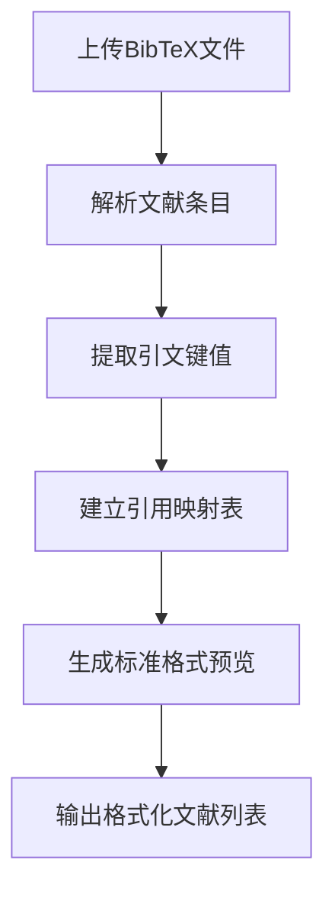

本系统提供完整的参考文献管理功能，支持BibTeX格式文献的导入、编辑、实时预览和标准化格式化。

## 核心功能架构

### 文献库可视化界面
参考文献库管理页面采用表格化布局，提供直观的文献信息展示和多维度的管理功能。

**主要组件结构**：
- **搜索区域**：支持按标题、作者或引文键值实时搜索
- **格式选择器**：支持GB/T 7714、APA 7th Edition、IEEE三种标准格式
- **文献列表**：显示引文键值、标题、作者和实时预览
- **操作面板**：提供新增条目和格式验证功能

Sources: [src/pages/ReferenceLibrary.tsx](src/pages/ReferenceLibrary.tsx)

## 引文数据处理流程

### BibTeX解析机制
系统通过专门的解析器处理BibTeX文件，提取文献信息并建立引用映射关系。



**关键处理逻辑**：
- 分割BibTeX条目并提取元数据
- 建立引文键值到编号的映射关系
- 支持多文献引用（`\cite{key1,key2}`格式）
- 处理特殊字符和LaTeX命令

Sources: [src/lib/testDocxGenerator.ts](src/lib/testDocxGenerator.ts)

## 实时预览系统

### 多标准格式支持
系统支持三种主流学术引用标准，实时生成格式预览：

| 标准格式 | 适用领域 | 预览示例 |
|---------|---------|---------|
| GB/T 7714 | 中文学术文献 | 作者. 标题[J]. 期刊, 年份, 卷(期): 页码. |
| APA 7th | 社会科学 | 作者 (年份). 标题. 期刊, 卷(期), 页码. |
| IEEE | 工程技术 | 作者, "标题," 期刊, vol. 卷, pp. 页码, 年份. |

Sources: [src/pages/ReferenceLibrary.tsx](src/pages/ReferenceLibrary.tsx)

## 文档转换集成

### 引文引用处理
在LaTeX文档转换过程中，系统自动处理文献引用：

1. **引用解析**：识别`\cite{}`、`\bibliography{}`等命令
2. **文献合并**：合并多个BibTeX文件中的文献条目
3. **编号生成**：根据引用顺序自动生成文献编号
4. **格式应用**：应用用户选择的引用格式标准

**示例转换逻辑**：
```typescript
// 解析BibTeX并建立映射
const bibMap: Record<string, number> = {};
const bibEntries = bib.split(/@[a-zA-Z]+\{/g).slice(1);
bibEntries.forEach((entry, index) => {
    const citeKey = entry.substring(0, entry.indexOf(',')).trim();
    bibMap[citeKey] = index + 1;
});

// 替换LaTeX中的引用命令
content = content.replace(/\\cite\{([^}]+)\}/g, (match, keysStr) => {
    const keys = keysStr.split(',').map(k => k.trim());
    const ids = keys.map(k => bibMap[k] || '?');
    return `[${ids.join(', ')}]`;
});
```

Sources: [src/lib/testDocxGenerator.ts](src/lib/testDocxGenerator.ts)

## 格式配置选项

### 参考文献格式设置
用户可通过格式设置面板自定义参考文献的显示样式：

**可配置参数**：
- **引用标准**：GB/T 7714-2015、APA、IEEE等
- **字体设置**：中文字体、英文字体、字号大小
- **排版格式**：行距、缩进、对齐方式
- **编号样式**：方括号、圆括号、上标等

**配置示例**：
```json
{
  "standards": {
    "references": {
      "style": "GB/T 7714-2015",
      "font": "五号",
      "family_cn": "宋体",
      "family_en": "Times New Roman"
    }
  }
}
```

Sources: [src/pages/FormatSettings.tsx](src/pages/FormatSettings.tsx)

## 数据导入导出

### 文件格式支持
系统支持多种文献数据格式的导入和导出：

| 格式类型 | 文件扩展名 | 支持功能 |
|---------|-----------|---------|
| BibTeX | .bib | 导入/导出、实时预览 |
| LaTeX | .tex | 引用解析、格式转换 |
| ZIP压缩包 | .zip | 批量导入（包含图片资源） |

**导入流程**：
1. 拖放或选择BibTeX文件
2. 系统自动解析文献条目
3. 生成引文键值映射表
4. 更新文献库显示

**导出流程**：
1. 选择目标格式（Word/PDF）
2. 应用引用格式标准
3. 生成格式化参考文献列表
4. 下载转换后的文档

Sources: [src/pages/WorkflowHub.tsx](src/pages/WorkflowHub.tsx), [src/lib/testBibtexGenerator.ts](src/lib/testBibtexGenerator.ts)

## 最佳实践建议

### 文献管理优化
1. **命名规范**：使用`作者年份标题`格式命名引文键值，如`vaswani2017attention`
2. **分类管理**：按研究领域或项目类型组织文献库
3. **定期备份**：导出BibTeX文件进行版本控制
4. **格式统一**：在团队协作中统一引用标准格式

### 性能优化
- 大型文献库建议分批处理，避免单次加载过多条目
- 使用搜索功能快速定位特定文献
- 定期清理未使用的文献条目

## 下一步学习路径
- [项目管理和版本控制](10-xiang-mu-guan-li-he-ban-ben-kong-zhi)：了解如何在项目中管理文献库版本
- [格式设置：精细化排版控制](8-ge-shi-she-zhi-jing-xi-hua-pai-ban-kong-zhi)：深入学习参考文献格式定制
- [工作流枢纽：文档转换核心](5-gong-zuo-liu-shu-niu-wen-dang-zhuan-huan-he-xin)：了解文献引用在文档转换中的完整流程