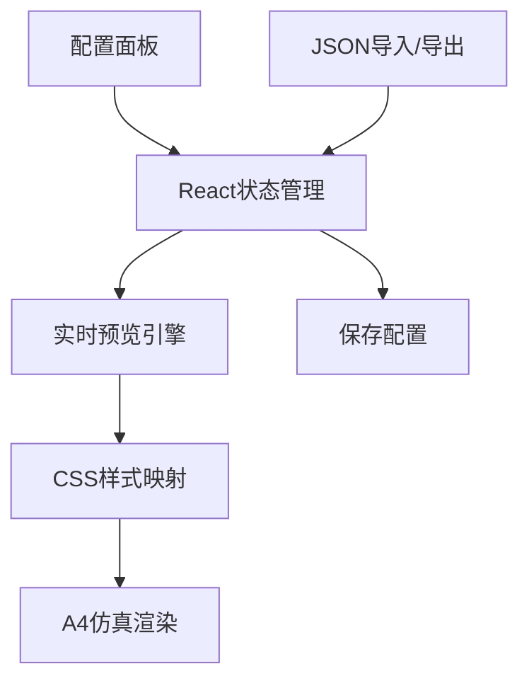

学术文档的排版质量直接影响内容的可读性和专业性。本系统的格式设置模块采用**实时预览驱动**的精细化控制架构，支持中英文字体隔离、多级标题智能编号、公式图表规范化等核心功能，确保生成的文档符合严格的学术出版标准。

## 架构设计概览

格式设置系统采用**配置-预览双向绑定**架构，左侧为参数配置面板，右侧为实时渲染预览区。所有排版规则通过React状态管理实现即时同步，用户调整参数后可立即在A4仿真纸张中观察最终效果。



**核心特性矩阵**

| 功能模块 | 控制维度 | 支持标准 |
|---------|---------|---------|
| **中英文字体隔离** | 独立字体、字号设置 | GB/T 7714-2015 |
| **多级标题系统** | 4级标题+智能编号 | 中文学术论文规范 |
| **公式排版** | 变量斜体、矢量黑斜体 | ISO 80000-2 |
| **表格自动化** | 三线表自动转换 | 学术期刊通用标准 |
| **参考文献** | 多种著录格式 | GB/T 7714/APA/IEEE |

## 核心配置模块详解

### 1. 页面布局控制

页面设置模块提供精确的**厘米级边距控制**和**分栏排版**功能，支持学术论文常见的版式要求。

```typescript
const [page, setPage] = useState({
  top: 3.4,    // 上边距(cm)
  bottom: 3.5, // 下边距(cm)
  left: 2.6,   // 左边距(cm)
  right: 2.5,  // 右边距(cm)
  columns: 1   // 分栏数(1/2/3)
});
```

**边距映射机制**：系统将厘米值转换为像素（1cm = 37.8px），在预览区绘制虚线边界框，确保精确的可视化反馈[源文件](src/pages/FormatSettings.tsx#L230-L250)。

### 2. 多级标题智能配置

标题系统支持**4级嵌套结构**，每级可独立配置：
- **序号模式**：支持"一、"、"（一）"、"1．"、"（1）"等中文标准格式
- **字体组合**：独立设置中文字体（黑体/楷体/仿宋）
- **对齐方式**：一键切换居中对齐

**数据结构示例**
```typescript
const [headings, setHeadings] = useState([
  { level: '一级标题', defaultPattern: '一、', font: '黑体', size: '三号', weight: 'bold', align: 'center' },
  { level: '二级标题', defaultPattern: '（一）', font: '楷体_GB2312', size: '三号', weight: 'normal', align: 'left' },
  // ...三级、四级标题
]);
```

### 3. 中英文字体隔离系统

采用**双字体栈**设计，确保中英文混排时的视觉一致性：

**中文字体映射表**
| 系统字体 | CSS映射 | 应用场景 |
|---------|---------|---------|
| 仿宋_GB2312 | `"FangSong_GB2312", "FangSong", serif` | 正文、图表标题 |
| 黑体 | `"SimHei", sans-serif` | 一级标题、文章标题 |
| 楷体_GB2312 | `"KaiTi_GB2312", "KaiTi", serif` | 摘要、二级标题 |

**西文字体映射表**
| 系统字体 | CSS映射 | 应用场景 |
|---------|---------|---------|
| Times New Roman | `"Times New Roman", Times, serif` | 英文正文、变量 |
| Arial | `Arial, sans-serif` | 无衬线场景 |

### 4. 公式与符号规范化

公式排版遵循**ISO 80000-2**国际标准：

- **物理量符号**：强制使用斜体（如*v*, *t*）
- **矢量矩阵**：黑斜体显示（如**A**, **x**）
- **独立公式**：居中对齐，序号右对齐
- **行内公式**：与正文基线精确对齐

**配置状态管理**
```typescript
const [standards, setStandards] = useState({
  formulas: {
    align: 'center',           // 对齐方式
    number_align: 'right',     // 序号位置
    italic_variables: true,    // 变量斜体
    bold_italic_vectors: true  // 矢量黑斜体
  }
});
```

### 5. 表格三线表自动转换

系统自动检测表格结构并转换为**三线表格式**：
- **顶线/底线**：1.5px粗线
- **栏目线**：1px细线
- **标题位置**：支持表格上方/下方灵活配置

**表格样式切换逻辑**
```typescript
{graphics.tables.auto_three_line ? 
  "border-t-[1.5px] border-b border-black" : 
  "border border-black bg-slate-100"}
```

## 数据持久化与交换

### JSON配置架构

系统支持配置的**导入/导出**，采用标准JSON格式便于版本控制和团队协作：

```json
{
  "fonts": {
    "cn": "仿宋_GB2312",
    "en": "Times New Roman",
    "size": "三号"
  },
  "headings": [...],
  "graphics": {
    "tables": {
      "auto_three_line": true,
      "align": "center",
      "title_position": "top"
    }
  },
  "auto_symbols": {
    "convert_quotes": true
  }
}
```

### 配置版本兼容性

导出的配置文件包含**完整的排版规则**，可在不同项目间复用，确保学术文档的格式一致性[源文件](src/pages/FormatSettings.tsx#L85-L120)。

## 实时预览技术实现

预览系统采用**CSS变量+动态样式注入**技术，实现配置的即时渲染：

1. **A4纸张仿真**：794×1123px精确尺寸，50%缩放优化显示
2. **边距可视化**：虚线框实时显示页边距范围
3. **字体即时切换**：通过`mapFontToCSS()`函数动态映射字体栈
4. **分栏动态布局**：CSS `column-count`属性实现即时分栏效果

**预览缩放算法**
```typescript
const scaleFactor = 0.5;
const marginBottom = '-561px'; // 1123px * 0.5 = 561px adjustment
```

## 智能规范转换

系统内置**学术写作规范检查器**，自动执行以下转换：

- **引号标准化**：将半角双引号"..."转换为全角"..." 
- **序号自动化**：标题序号自动递增，支持多级嵌套
- **单位格式化**：物理量单位正体化（如m/s, kg·m²）
- **参考文献格式化**：支持GB/T 7714-2015、APA 7th、IEEE标准

## 使用最佳实践

### 推荐工作流程

1. **项目初始化**：导入期刊/会议指定的格式模板
2. **全局设置**：配置中英文字体、字号、行距
3. **标题定制**：根据层级要求设置4级标题样式
4. **元素配置**：设置图表、公式、参考文献格式
5. **实时验证**：在预览区检查各元素渲染效果
6. **配置导出**：保存为项目专属格式模板

### 性能优化建议

- **批量配置**：一次性设置多项参数后统一保存
- **模板复用**：相似项目直接导入历史配置
- **预览缩放**：在复杂文档中使用50%预览比例提升性能

---

**下一步学习路径**：掌握格式设置后，建议深入[预导出审计系统](9-yu-dao-chu-shen-ji-xi-tong)，了解自动化格式验证流程，确保最终输出符合目标期刊要求。