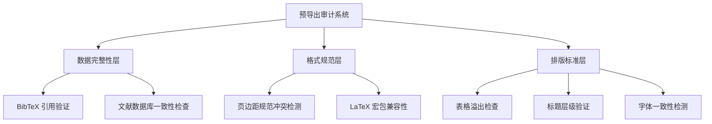
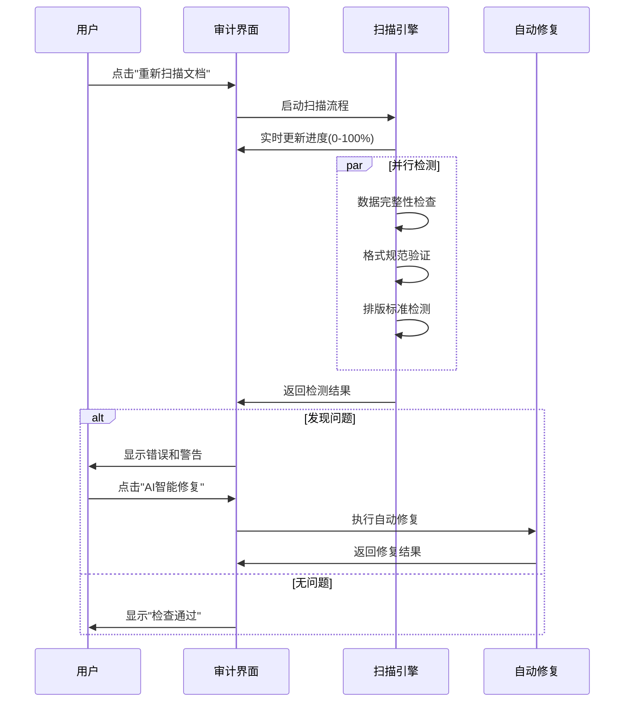

预导出审计系统是学术文档转换流程中的质量保障核心，通过多层次自动化检测机制在文档导出前识别并修复潜在问题，确保最终输出符合学术出版标准。

## 系统架构设计

### 多层次审计引擎

系统采用分层检测架构，从数据完整性、格式规范到排版标准进行系统性检查：



### 实时扫描机制

系统实现渐进式扫描流程，支持实时进度反馈和结果展示：



## 核心审计维度

### 数据完整性检查

验证文档引用与文献数据库的一致性，防止导出时出现缺失引用：

**检测项目**：
- BibTeX 键值匹配性检查
- 文献条目完整性验证
- 引用格式标准化检测

**实现机制**：
- 解析 LaTeX 文档中的 `\cite{}` 命令
- 与 `.bib` 文件条目进行交叉验证
- 识别缺失或格式错误的引用键

**典型问题示例**：
```
正文第二段引用的 [@smith2023] 在您上传的 references.bib 文件中未找到对应条目定义。
```

### 格式规范冲突检测

对比文档实际格式与目标期刊要求进行差异分析：

**检测项目**：
- 页边距规范一致性
- 字体大小和类型匹配
- 标题层级和样式验证

**实现机制**：
- 解析当前文档的格式设置
- 与期刊配置 JSON 进行参数对比
- 计算数值差异并识别冲突

**典型问题分类**：
- **错误（Error）：影响导出的致命问题
- 警告（Warning）：建议修改建议

### 排版标准合规性验证

确保文档元素符合学术排版规范：

**检测项目
表格结构验证（三线表标准）
- 图片标题位置一致性
- 数学公式格式正确性

## 实现机制
基于规则引擎的模式匹
- 自动化结构分析

##  用户界面设计

### 双栏布局结构

**左侧面板（详细审计）**：
- 实时扫描进度显示-按类别分组的问题列表
- 针对每个问题的具体修复按钮

**右侧面板（状态总览
- 健康度评分系统健康度评估（0-1000分）
- 问题统计汇总
- 导出操作入口

### 交互式修复

智能修复机制支持：

**AI 智
- 自动识别缺失文献条目
- 智能补全引用信息
- 一键修复格式冲突

**格式自动
- 页边距参数标准化
- 字体家族一致性调整
- 标题样式优化

## 技术实现

###状态管理：React useState
- 实时进度跟踪：定时器+状态绑定
- 视觉反馈：SVG环动画+实时更新

### 健康度计算

系统根据问题级别动态计算健康度评分

**计算公式**：初始分数：100分
-致命错误：每个扣21分/每个
- 警告：扣1分/每个

**状态指示器：
- 绿色（10分）：准导出
- 黄色（790-9分）：建修复
- 红色（<分）：阻止导出

## 与系统集成

###配置接审计系统从格式设置页面获取目标标准：

```json
{
  "fonts": "2.6cm",
 3.0cm",
  "bottom": 3.5,
  "left": 2.5,
 "right": .4
}
```

###日志集成

错误处理

系统通过 ExportLogs 页面提供详细的审计日志：

-详细的 Pandoc 转换日志记录
- AI 诊断建议生成
- 导出统计信息追踪

## 最佳实践建议

1. 2. **预防性扫描**：** 在编辑过程中定期运行快速扫描，及时发现和修复问题
3. **智能修复验证：** 每次自动修复后重新扫描，确保问题4. **配置优化：** 根据期刊要求调整格式设置，减少冲突发生

###性能考虑-增量扫描：仅检测变化部分只扫描修改内容
-并行处理：独立检查类别同时
缓存机制：存储中间结果

## 审计系统通过自动化检测和智能修复，显提高了学术文档的导出成功率确保终出符合严格出版标准。